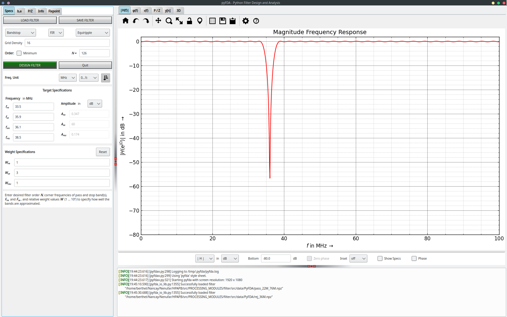

# PyFDA

This page explains how to generate coefficients for filter module.  
To do it we use pyFDA, it's a open source python program. To dowload it : 
``` console
pip install pyfda
```
And to launch it : 
``` console
pyfdax
```
## Import existing filter
Now you can load a an existing filter project (`.npz`) to autoconfigure different parameters.   
Files : [svn/NenuFar/trunk/receivers/RadioGAGA/doc/](https://svn.obs-nancay.fr/svn/NenuFar/trunk/receivers/RadioGAGA/doc/)  -- todo




## Export new set of coefficients
Now to generate a new filter you just have to modify frequency and weight parameters as your wish.  
Then when you are satisfied by the configuration, click on **b,a** tab, then set fields to **Dec** and **Integer** with **W = 16**


Click on save button and save it in [svn/NenuFar/trunk/recepteur_LANewBa/trunk/firmware/HPAPB/src/PROCESSING_MODULES/filter/src/data/PyFDA/](https://svn.obs-nancay.fr/svn/NenuFar/trunk/recepteur_LANewBa/trunk/firmware/HPAPB/src/PROCESSING_MODULES/filter/src/data/PyFDA/)