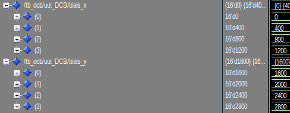
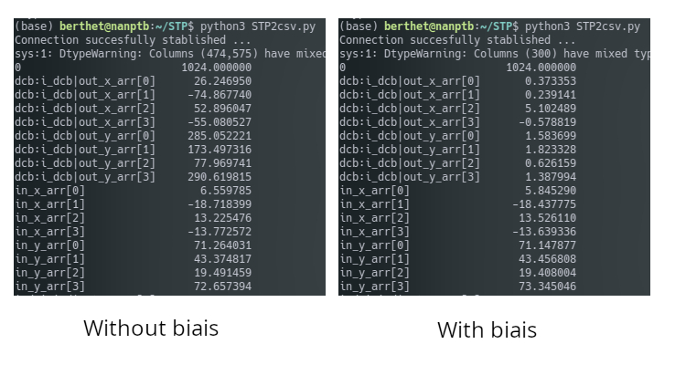

# DCB 

## Introduction

This document will present and confirm the fonctionnement of DCB module. We will see what it expected in simulation. And confirm the fonctionnement with Signal Tap in the FPGA

## Presentation

The figure 1 show the port of the module. The input is directly connected to the output of IPD module. Input data bus is size of 8x14 bits and 8x16 bits in output. The goal of this module is to add biais in order to delete DC offset from the ADC. To do this the module allow to estimate the average of the input. To read average and configure biais the register interface is set like below.  
The module has the address offset of `16#1350000#`.  
16#1350000# = c_processing_address_offset + c_radiogaga_address_offset + c_DCB_address_offset

|Name                        | Address  | Read | Write | Width |   Comment                                |
|----------------------------|--------- |------|-------|-------|------------------------------------------|
| c_DCB_biais_x_offset       | 16#00#   | x    |  x    |  4    | Delete DC offset on ADC                  |
| c_DCB_biais_y_offset       | 16#10#   | x    |  x    |  4    | Delete DC offset on ADC                  |
| c_DCB_accu_x_low_offset    | 16#20#   | x    |       |  4    | Lower bits of accumulator                |
| c_DCB_accu_y_low_offset    | 16#30#   | x    |       |  4    | Lower bits of accumulator                |
| c_DCB_accu_x_high_offset   | 16#40#   | x    |       |  4    | Higher bits of accumulator               |
| c_DCB_accu_y_high_offset   | 16#50#   | x    |       |  4    | Higher bits of accumulator               |

## Simulation

### Biais add

DCB has 2 writable registers, `biais_x` and `biais_y`. Those biais has a width of 16 bit, 14 for integer part and 2 for decimal part. If we apply a biais of 10, these are : 

$(1010)_{2}=(10)_{10}$

$(1010+00)_{2}=(40)_{10}$

So we can apply biais to both polarization of each antenna. In simulation, I set biais incrementally by 100, like this we can see + 100 on each channels.

To set biais we have to write in following registers :

\# X polar  
16#1350000# = 0  
16#1350001# = 400  
16#1350002# = 800  
16#1350003# = 1200  

\# Y polar  
16#1350010# = 1600  
16#1350011# = 2000  
16#1350012# = 2400  
16#1350013# = 2800  

The value are multiply by 4 caused by 2 bit added for the decimal part.

So now we apply a signal of 10 on all the input : 

### Average estimation

To set biais we need to estimate the average of the input. To calcul it, the FPGA accumulate the input during 200M of sample (1 sec). Is difficult to divide in vhdl, so the module return the accumulation not normalized. The division by 200M will be done by the soft on server. 

On the figure 4 we can see the signal accumulate on a period of 1 µs (1 sec in reality). On the right bottom corner, the accumulation is latched on a rising edge of `sync` and we can see the value of the accumulation during 1µs. 
So on the X input it gives : 

*In FPGA*

n_sample = 1 000ns/5ns  
n_sample = 200  
accu_x_r = 50 * 200  
accu_x_r = 10 000

*In soft*

moyenne = 10 000 / 200  
moyenne = 50

## Signal TAP

### Biais add

To verify the fonctionnement of this module on the FPGA, the input of the card are still open. To estimate the average on each input I realized a little python program to parse the signal TAP data. With and without biais configuration it gives : 

On the left of figure 5 we can see the average on 1024 sample on each input. DCB out is just the input with 2 bit added for decimal part.On the right of the figure 5 we can see when we applied biais on each entry. To this we apply `-26.2 (4 x 6.55)` on in_x_arr[0] `+74.9` on in_x_arr[1] etc. Values are nears to zero, what is expected.

## 5.2. Average Estimation

Now to read accumulation from the FPGA it was a bit complicated. The value is accumulate in a 40 bits word. But the register interface accept only until 32 bits word. So i cut the word in 2 part ;  low_acc(32 lower bits) and high_acc(8 higher bits). In the soft those value are stock in two variable `uint64_t`. The MSB is duplicated on the whole word to keep the sign. Then the hig_acc part is shifted by 32 bits. Finally the 2 parts are added to be divided by 200M.

For Example on the figure 6 we can see the DC offset on the Y polarisation. That's correspond with the figure 5. 

