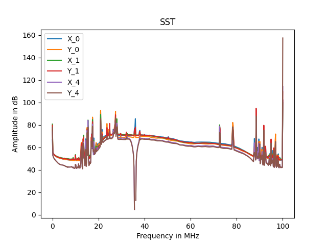

# Filter 

## Introduction

This page will confirm the fonctionnement of the filter module. We will see what it expected in simulation. And confirm the fonctionnement with signaltap in the FPGA

## Presentation


The figure 1 shows ports of the module. The input data bus is directly connected to the output of presum. Input data bus is size of 2x18 bits and 2x18 bits in output. This module is a numeric filter. It takes 128 coef and use FIR implementation to filter the signal. It possible to shift the output of the signal to decrease the gain of the filter.   
The module has the address offset of `16#1370000#`.  

16#1370000# = c_processing_address_offset + c_radiogaga_address_offset + c_filter_address_offset

|Name                             | Address | Read | Write | Width |   Comment                                | 
|---------------------------------|---------|------|-------|-------|------------------------------------------| 
| c_filter_coef_offset            | 16#00#  | x    |  x    |  128  | Coefficient of the filter                |
| c_filter_shift_offset           | 16#FF#  | x    |  x    |  1    | Shift to apply on the output             |


This module has 2 architectures, **normal** and **transposed**. Difference between both are explained [here](https://www.allaboutcircuits.com/technical-articles/pipelined-direct-form-fir-versus-the-transposed-structure/).
Today, is the transposed structure that is used, it allows to use DSP blocks in FPGA, explained [here](https://www.intel.com/content/dam/www/programmable/us/en/pdfs/literature/an/an639.pdf).
 
This module have important generic port to determine the good fonctionnement.  

- **g_round_mod** : This allow to choose the rounding mode for the output. Today only *truncate* is available.
- **g_nof_coef** : Determine the number of coefficient for the implementation. 128 is sufficient for our application. 
- **g_out_data_shift** : For the normal architecture only, the shift is not configurable in the register interface so it's declared here.
- **g_acc_w** : $18 + 18 + \frac{log(128)}{log(2)} = 44$
- **g_coef_w** : Coefficients are defined on 16 bits.
- **g_shift_w** : The shift value is defined on 6 bits.


## Simulation

### Ramp coefficients

First of all before to test is the filter make the job, we can set coefs from 0 to 128 by 1. To do this we have to write to the following addresses : 

16#1370000# = 1  
16#1370001# = 2  
16#1370002# = 3  
...  
16#13700126# = 127  
16#13700127# = 128  


On the figure 2 we can see a pulse of **1** is sent on `in_x.data` during only one sample. We have 2 outputs because I instantiate both architecture, normal and transposed. So we can see our pulse multiplied by each coefficient until the 128th. 

!!! info
    We can notice the transposed implementation generates less retard than the normal structure. 


### Shift test

To compensate the gain involved by the filter. An adjustable shift is implemented. It allow to shift to the right the signal. For exemple : 
```vhdl
mysignal   <= 80 --(0b1010000)  
mysignal   <= shift_right(mysignal, 2)  
-- mysignal = 20   (0b10100)  
```


On the figure 3 the pule is now of **16** and the shift of **2**. And we can see on the output the signal is always multiplied by the ramp coefficients but now is divided by $2^2 = 4$


## Signal TAP

### Test of a 36MHz rejector 

To verify the fonctionnement of the filter I directly test it in the FPGA. For it I just generated a sinusoidal with a GBF. 


On the figure 4 we can see a signal of 30MHz, it pass trough without any attenuation. 


Now on the figure 5 we can see the signal is a bit attenuated at 35MHz and completely at 36MHz.  
We can also see the spectrum of the output. There is a big reject of 50dB at 36M.




!!! info
    The filter module is instantiate 3 times, so we can apply 3 different filters on the signal. We just have to reconfigure the coefficient in the register interface. To generate coefficient, we used pyFDA explained here : [PyFDA doc](../divers/PyFDA.md) 