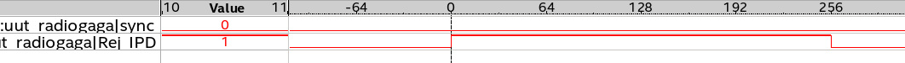

# IPD Module

## Introduction

This page will confirm the fonctionnement of the IPD module. We will see what it expexted in simulation. And confirm the fonctionnement with signaltap in the FPGA

## Presentation

The figure 1 shows ports of the module. The input data bus is directly connected to the output of ADC. Input data bus is size of 8x14 bits and same in output. This module is a delay line, it allows to to correct time travel of signal above the instrument.  To do this the module allows to set a delay from 0 to 255 sample on each channel. Those delay are configurable in the register interface
The module has the address offset of `16#1340000#`.  
16#1340000# = c_processing_address_offset + c_radiogaga_address_offset + c_IPD_address_offset

|Name                        | Address  | Read | Write | Width |   Comment                                |
|----------------------------|--------- |------|-------|-------|------------------------------------------|
| c_ipd_delay_x_offset       | 16#00#   | x    |  x    |  4    | Add delay to antennas on X polar         |
| c_ipd_delay_y_offset       | 16#10#   | x    |  x    |  4    | Add delay to antennas on X polar         |

## Simulation

### Shift test

IPD has 2 writable registers, *delay_x* and *delay_y*. So we can apply delay to both polarisations of each antenna. Each delay can be set on the range [0:255]. In simulation, I set delay incrementally by 25, like this we can see a shift of 25 sample on each channels. For this I wrote in the following registers :   

\# X polar  
16#1340000# = 0  
16#1340001# = 25  
16#1340002# = 50  
16#1340003# = 75  

\# Y polar  
16#1340010# = 100  
16#1340011# = 125  
16#1340012# = 150  
16#1340013# = 175  

For simulation I sent the same pulse on each channels as we can see on `in_y_arr(0)`.   
First of all, we can see a shift between `in_y_arr(0)` and `out_x_arr(0)` . The delay of it was set to *0* but there is a shift of *15 ns.* This  is due by signal latching in VHDL. This delay is equivalent as 3 clock shots. This delay is not really important because it is applied on each `OUT` channel, so if we mesure shift between them, it will be correct.  

Now we can see on the figure 3 a shift of 125 ns between the `out_x_arr(0)` and `out_x_arr(1)`. 

$25 = 125 / 5 ns$. Our shift is correct.

An other example on the figure 4 between the first channel `in_x_arr(0)` with delay set at *0* and the last sample `in_y_arr(3)` with delay set at $175 = 875 / 5 ns$

### Rej_IPD test

When delays are set by the register interface, signals can be unstable during the max length of the delay-line. So after reset or reconfiguration the signal Rej_IPD is pulled high. Such as the out signal is invalid during this period. 

- At the beginning of the simulation Rej_IPD is pulled high because the FPGA start up
- On the first yellow marker, delays are set by  interface register, Rej_IPD is pulled high again 
during $1280 = 256 * 5ns$
- On the third yellow marker we can see an another writing configuration by register interface.

## Signal TAP

### Shift test

To test the FPGA in real condition, I set a signal tap with some interesting signal. On input of the card. I set a pulse sent every milliseconds.

On the figure 6 we can see a test with delay set to *0* and the figure 7  incrementally by *25* such as in simulation

### Rej_IPD test

To test it, i just put a trigger on Rej_IPD, reconfigure the delays and we see the signal is pulled HIGH during 255 sample. 

