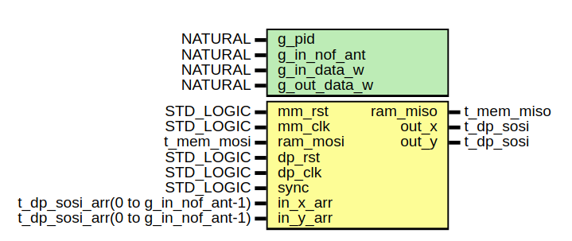
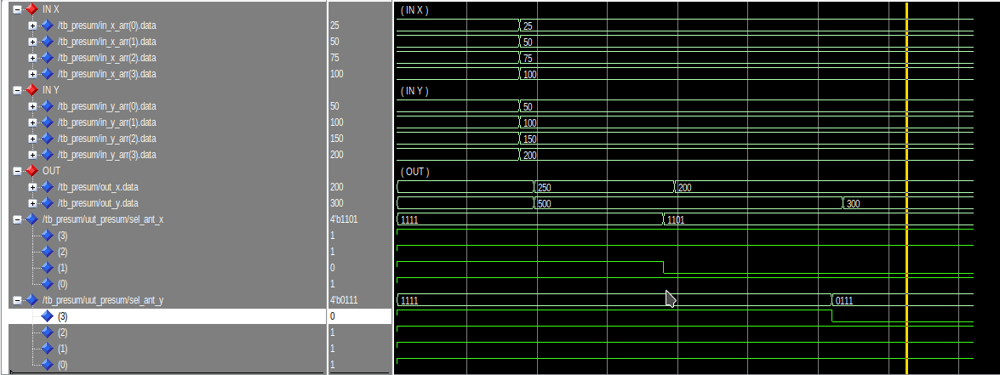
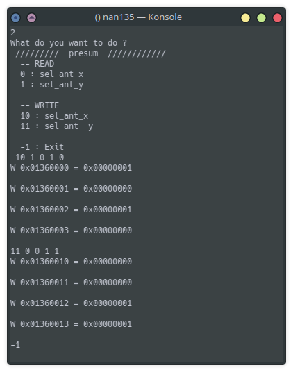
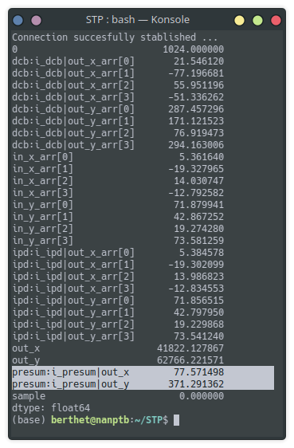

# Presum

## Introduction

This page will confirm the fonctionnement of the presum module. We will see what it expected in simulation. And confirm the fonctionnement with signaltap in the FPGA

## Presentation

The figure 1 shows ports of the module. The input is directly connected to the output of DCB. Input data bus is size of 8x16 bits and 2x18 bits in output. This module will just add all antennas on both polarization. In register interface it's allow to disable one or more antenna. The register interface is set like below.
The module has the address offset of `16#1360000#`.  

16#1360000# = c_processing_address_offset + c_radiogaga_address_offset + c_presum_address_offset

|Name                             | Address | Read | Write | Width |   Comment                                | 
|---------------------------------|---------|------|-------|-------|------------------------------------------| 
| c_presum_ant_sel_x_offset       | 16#00#  |  x   |   x   |   4   | Disable antennas on x polar              | 
| c_presum_ant_sel_y_offset       | 16#10#  |  x   |   x   |   4   | Disable antennas on Y polar              | 

## Simulation

### Enable/disable antennas

The register ant_sel_x and ant_sel_y are initialized to `'1'` in the FPGA. Like this all inputs are enable. To disable we have to write `'0'` to the antenna which we want want to disable.  
For exemple to disable the 2nd and 4th antenna of the X polarization we have to write in the register interface like below :

\# X polar  
16#1360000# = 1  
16#1360001# = 0  
16#1360002# = 1  
16#1360003# = 0  

### Summation

Now the FPGA check for each antenna if ant_sel is `'0'` or `'1'` and if is `'1'` datas of the inputs are added, else the input is replaced by zero. 

On the figure 2, at the beginning of simulation, all antennas are set to `'1'` so the output is equal to sum of 4 antennas for each polarization. Then  the 2nd and the 4th antenna are disable for X and Y polar respectively. 

## Signal TAP

### Enable/disable antennas

On the figure 3 we can read and write in both register. For this test we can see I disable the 2nd and the 4th antenna for the X polar. And for the the 1st and 2nd antenna are disable.

### Summation

To verify the good fonctionnement of it, we will use the same python program like we used to test DCB. It export data from signal TAP and we can read the average of each polar in different modules. 

On the figure 4  we can see the sum on highlight lines. presum_out is equal to the sum of DCB_out_x_arr[n] on each polar. 

So if we take the exemple beside for X polar :  
presum|out_x = dcb|out_x_arr[0] + dcb|out_x_arr[2]
presum|out_x = 21.5 + 56
presum|out_x = 77.5

And for the Y polar : 

presum|out_y = dcb|out_x_arr[2] + dcb|out_x_arr[3]
presum|out_y = 76.9 + 294.2
presum|out_y = 371.1

