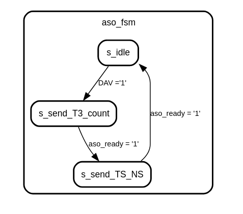

# UDP Sender

## Introduction

This document will present and confirm the fonctionnement of UDP_sender module. We will see what it expected in simulation. And confirm the fonctionnement with Signal Tap in the FPGA.

## Presentation

This has to sent an UDP frame on the network when a cosmic gerbe is detected. The frame will be transmitted by a 10G link. For this on the figure 1 we can see different ports (yellow) of the module.  
In the generic interface (green) we can set the default IP configuration of the destination server.

On the figure 2 we can see the state machine of the module. By default the module is in **idle** mode. It is waiting a **DAV** from the trigger module.  
When a DAV is sent, the module will put 2 packets of 64 bits in the frame : 

-- First packet --  
**!T3!** : Header of the frame. 4 ASCII character, so 32 bits width.  
**count** : Number of the frame since the boot of the card. 

-- Second packet --  
**timestamp** : Is the timestamp when the trig happened  
**nanosecond** : Is the nanosecond in the timestamp when the trig happened for more accuracy.

So now one the figure 3 we can see reception of a frame with netcat. 

The module has the address 16#980000#. Below they are the different address of the register interface.

|Name                           | Address  | Read | Write | Width |   Comment                                    |
|-------------------------------|--------- |------|-------|-------|----------------------------------------------|
|c_UDP_sender_version_id_offset | 16#00#   | x    |       |  1    | Version _ id of the framer                   |
|c_UDP_sender_lo_32_mac_offset  | 16#01#   | x    |  x    |  1    | Lower 32 bits of the mac address             |
|c_UDP_sender_hi_16_mac_offset  | 16#02#   | x    |  x    |  1    | Higher 32 bits of the mac address            | 
|c_UDP_sender_ip_offset         | 16#03#   | x    |  x    |  1    | Ip address                                   |
|c_UDP_sender_port_offset       | 16#04#   | x    |  x    |  1    | Port                                         |
|c_UDP_sender_manual_dav_offset | 16#05#   |      |  x    |  1    | Allow to send a frame manually (for test)    |
|c_UDP_sender_delay_ns_offset   | 16#06#   | x    |  x    |  1    | Time in number of sample to delete the traitement time |
|c_UDP_sender_enable_offset     | 16#07#   | x    |  x    |  1    | Enable/disable to sending frame on 10G output |

## Simulation 

To simulate this module, we have just have to up DAV during one sample and watch the frame on the 10G bus.

Here we can see the nanosecond during the pulse is **1F9** and we can see it in the frame on aso_data.

Now the DAV is always at **1F9** but in the frame we see **159**. Because we want to delay of 32 sample.   
0x1F9 - 32 * 5 = 0x159 

## Signal TAP

In the register interface of UDP sender is possible to send a DAV manually. Is very useful to test if the 10G configuration is working well.  
So on the figure 6 we see in the terminal we write **'1'** in at the address 16#980005#. So after this the frame is built and put on the 10G interface.
By inverting the bytes 2 by 2 we can read timestamp and nanosecond correctly.

