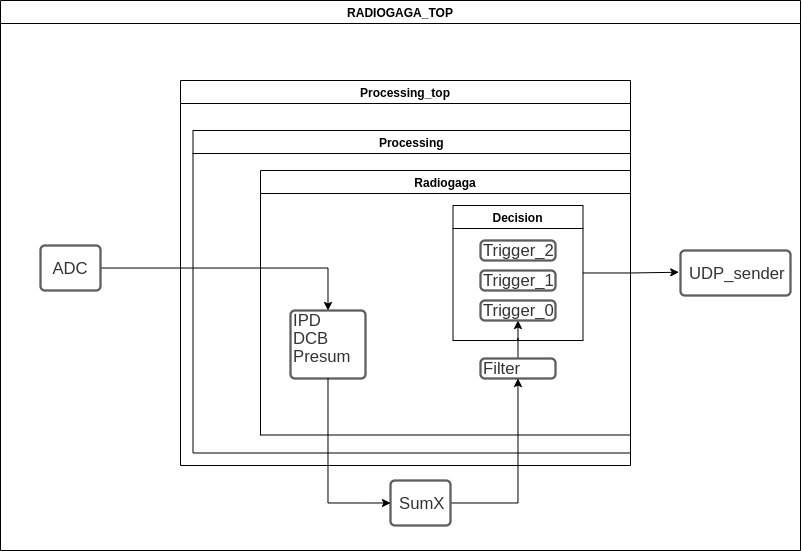
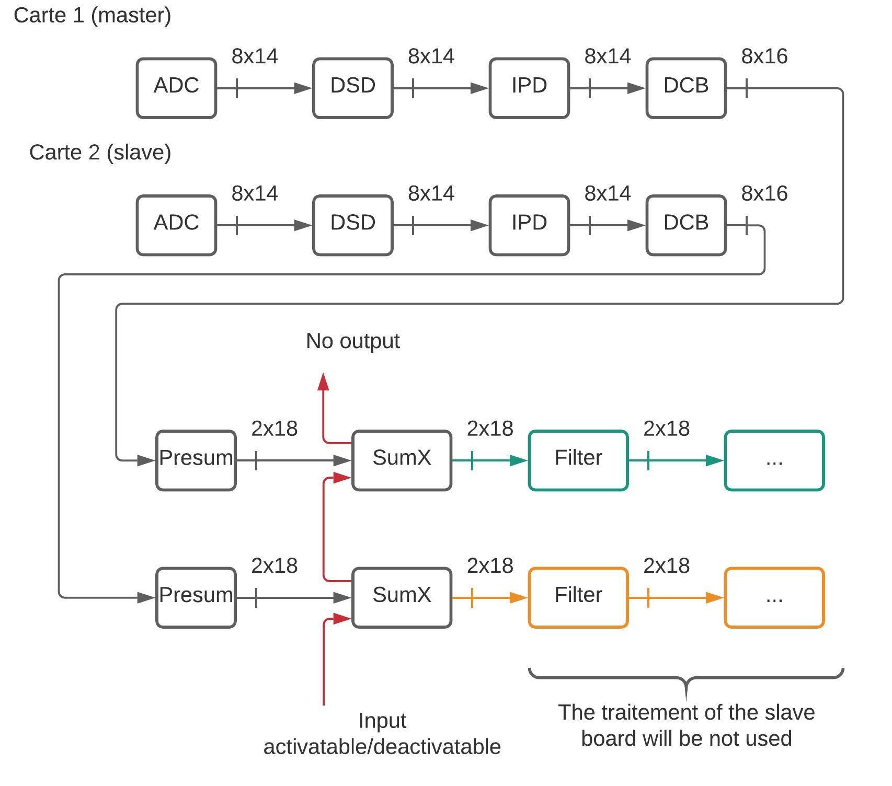

This page explains the structure of Radiogaga firmware. It will be explained how and where different modules are instantiates.

On the figure 1 we can see where each module is instantiates. And on the figure 2 we have a more detailled view of different interconnection between 2 board.

- [RADIOGAGA_TOP.vhd](https://svn.obs-nancay.fr/svn/NenuFar/trunk/recepteur_LANewBa/trunk/firmware/HPAPB/src/RADIOGAGA_TOP.vhd) is top file of the project.  
- [processing_top.vhd](https://svn.obs-nancay.fr/svn/NenuFar/trunk/recepteur_LANewBa/trunk/firmware/HPAPB/src/PROCESSING_FOR_RADIOGAGA/src/vhdl/processing_top.vhd) instantiates all processing modules, dsd, rsr, processing etc.  
- [processing.vhd](https://svn.obs-nancay.fr/svn/NenuFar/trunk/recepteur_LANewBa/trunk/firmware/HPAPB/src/PROCESSING_FOR_RADIOGAGA/src/vhdl/processing.vhd) instantiates processing and radiogaga.   
- [radiogaga.vhd](https://svn.obs-nancay.fr/svn/NenuFar/trunk/recepteur_LANewBa/trunk/firmware/HPAPB/src/PROCESSING_MODULES/radiogaga/src/vhdl/radiogaga.vhd) instantiates all signal processing modules for radiogaga wich are located in [PROCESSING_MODULES](https://svn.obs-nancay.fr/svn/NenuFar/trunk/recepteur_LANewBa/trunk/firmware/HPAPB/src/PROCESSING_MODULES/) directory.

