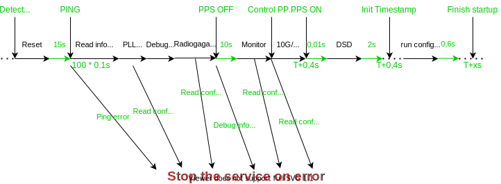

# Startup sequence

This chapter will present step by step the configuration needed at the startup of the HPAPB board.  
The firmware RadioGaGa is based on LANewBa, so there is a lot of similitude between both.



---  
### Ping 
First of all when tartup is detected we need to ping the board on the 1G interface.   
**1G configuration :**

- GEDEK_IP_ADDRESS   : `192.168.6.128 + number_of_the_card`
- GEDEK_MACADDRESS   : `00:07:ed:a8:06:80`
- GEDEK_UDP_AVM_PORT : `2271`
- GEDEK_UDP_TXPORT   : `1271`

###  Read status  
Read constant of the board (version of the firmware, temperature etc.) Sames addresses than LANewBa.
```
TODO
```

### ADC and PLL configuration

There is exactly same on LANewBa, we need to run the file :  
[svn/NenuFar/trunk/recepteur_LANewBa/trunk/firmware/HPAPB/soft/HPAPB_LMK.conf](https://svn.obs-nancay.fr/svn/NenuFar/trunk/recepteur_LANewBa/trunk/firmware/HPAPB/soft/HPAPB_LMK.conf)

### Config RadioGaGa modules
To configure RadioGaGa modules, we need to run the `startup_configuration_board_X.conf` for each board. For more information read this page : [Software/Configuration files](Configuration_files.md)

### Monitor 
Run the configuration file [svn://MonitorPath](todo)

### DSD 

Write `'1'` in the register `c_DSD_control_offset`
```
W 010300F0 1
```

### END of startup configuration

